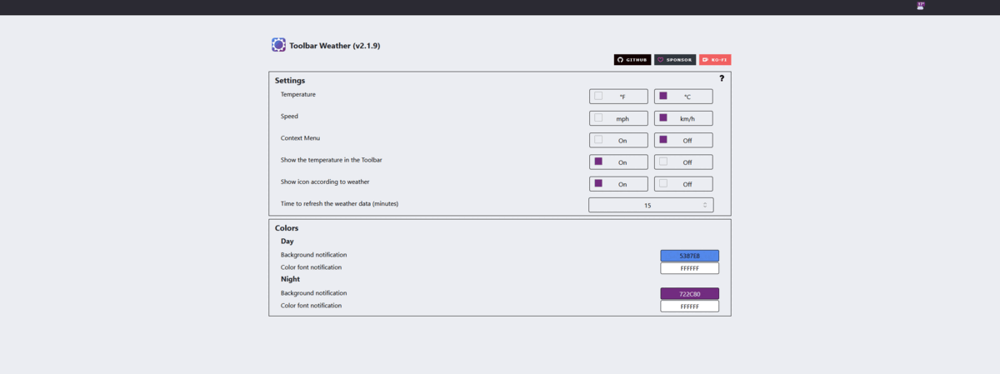

[](https://img.shields.io/github/issues/jhonatasrm/toolbar-weather.svg)
[](https://img.shields.io/github/license/jhonatasrm/toolbar-weather.svg)
[](https://img.shields.io/github/release/jhonatasrm/toolbar-weather.svg)


# Toolbar Weather [](https://addons.mozilla.org/en-US/firefox/addon/toolbar-weather/)

This extension shows in your toolbar the current weather and the degree in Celsius, when you click is possible see more details about the weather on your city. Easier than looking out the window !



## Requirements
* Firefox 57.0 or later

## Features
* Geolocation
* Degrees Celsius
* Description of the weather
* Current temperature (°C or °F)
* Temperature min and max (°C or °F)
* Humidity (%)
* Speed wind (km/h or mph)
* Gust (km/h or mph)
* Forecast for the next 2 days
* Page about
* Page preferences
* Context Menu

## How to test this extension

1. Clone this repository git clone ```https://github.com/jhonatasrm/toolbar-weather.git```

2. In the Firefox address bar type ```about:debugging```

3. Click ```Load Temporary Add-on```, a dialog window opens.

4. In the cloned repository, select the ```manifest.json``` file. The webextension icon will appear in your toolbar.

## How Contribute

Have a suggestion, doubt or encountered an error? Please open a new [issue](https://github.com/jhonatasrm/toolbar-weather/issues).

### Donate

Would you like to contribute to the development of this and other add-ons that can be found <a href="https://addons.mozilla.org/en-US/firefox/user/13670188/">here</a> ? 

I would be very happy if you can contribute, any value will surely be of great help.

Thank you so much for helping me continue developing this and other add-ons! <3

You can donate via PayPal <a href="https://www.paypal.com/cgi-bin/webscr?cmd=_donations&business=jhonatasrm@gmail.com&lc=US&item_name=Donation+to+Toolbar+Weather&no_note=0&cn=&curency_code=USD&bn=PP-DonationsBF:btn_donateCC_LG.gif:NonHosted">here</a>. Thanks again! 

## Learn More
To learn more about webextensions development, see this [Mozilla developer Network documentation](https://developer.mozilla.org/en-US/Add-ons/WebExtensions).

### License
This repository is available under the [Mozilla Public License, version 2.0](https://github.com/jhonatasrm/toolbar-weather/blob/master/LICENSE)
