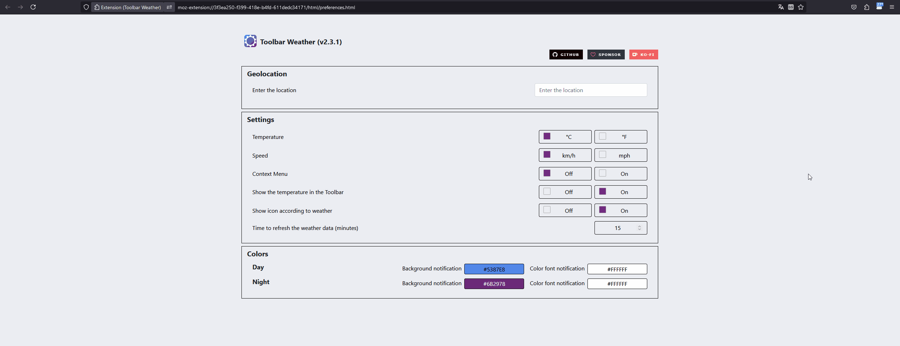

[](https://github.com/jhonatasrm/toolbar-weather/issues)
[](https://github.com/jhonatasrm/toolbar-weather/blob/master/LICENSE)
[]()
[]()
[](https://github.com/jhonatasrm/toolbar-weather/releases)


# Toolbar Weather [](https://addons.mozilla.org/en-US/firefox/addon/toolbar-weather/)

The Add-on shows in your toolbar the current weather and the degree in Celsius or Fahrenheit, when you click is possible to see more details about the weather in your city, also you can be able to view the forecast for the next 24 and 48 hours and adjust the display preferences.



## Requirements
* Firefox 63.0 or later

## Features
* Geolocation
* Manual location
* Degrees Celsius or Fahrenheit
* Description of the weather
* Current temperature (°C or °F)
* Temperature min and max (°C or °F)
* Humidity (%)
* Speed wind (km/h or mph)
* Gust (km/h or mph)
* Forecast for the next 2 days
* Page about
* Page preferences
* Context Menu
* Preferences in the Popup
* Picker color to change background and font of notification
* Shows the temperature in the Toolbar
* Shows icon according to weather
* Time to refresh the weather data (minutes)
* Translated in 5 locales: 
  * Español
  * English 
  * French
  * Polish
  * Português (do Brasil)

## Configuration

To use this Add-on locally, you will need API keys for the services listed below. Follow these steps to configure them:

#### OpenCage API Key
1. Sign up on [OpenCage](https://opencagedata.com/).
2. Generate your API key.
3. Insert the key in the geocoding field in the Add-on settings.

#### OpenWeather API Key
1. Create an account on [OpenWeather](https://openweathermap.org/).
2. Obtain your API key.
3. Insert the key in the appropriate field in the Add-on settings.

## How to test this extension

1. Clone this repository git clone ```https://github.com/jhonatasrm/toolbar-weather.git```
2. In the Firefox address bar type ```about:debugging```
3. Click ```Load Temporary Add-on...```, a dialog window opens
4. In the cloned repository, select the ```manifest.json``` file. The webextension icon will appear in your toolbar

## APIs Used

This Add-on uses the following APIs to provide geolocation and weather functionalities:

* [OpenCage API](https://opencagedata.com/)<br>
Used for geocoding and location searches. It allows the conversion of geographic coordinates (latitude and longitude) into physical addresses and vice versa.

* [OpenWeather API](https://openweathermap.org/)<br>
Used to fetch weather data such as temperature, forecast, and real-time weather conditions. It supports different units of measurement like Celsius and Fahrenheit.

## How Contribute

Have a suggestion, question or encountered an error? Please open a new [issue](https://github.com/jhonatasrm/toolbar-weather/issues).

Contributions are welcome! Feel free to submit a pull :)

If you'd like the content translated into your preferred language, feel free to open an issue requesting the translation.

## Learn More
To learn more about webextensions development, see this [Mozilla developer Network documentation](https://developer.mozilla.org/en-US/Add-ons/WebExtensions)

### License
This repository is available under the [Mozilla Public License, version 2.0](https://github.com/jhonatasrm/toolbar-weather/blob/master/LICENSE)
